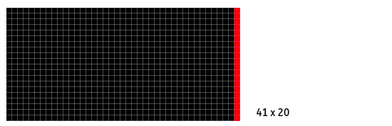
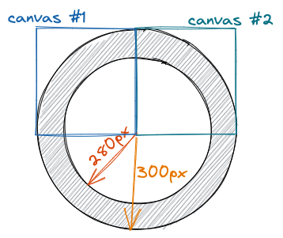

I was having a discussion with one of my colleagues on the decision of using SVG
format instead of PNGs of various predefined sizes. We knew predefined-PNGs
was the preferred way to go for our colleagues in charge with Android/iOS development.

As a web developer engineer, I was a bit in shock hearing PNG, a raster format,
would indeed be an option. Isn't a vectorial format supposed to deliver top quality
for illustrations? I started to challenge my beliefs - What if, just what if,
for a given width and a given height, a PNG export would have a superior
result when compared to the "on-the-fly" rendering of an SVG?

With this question in mind, let's set our image rendering theory straight.

###Small intro into image formats

PNG, JPG and WEBP are raster data formats for images. Their canvas size is predefined,
described by width & height, and the data inside the file describes the colours
of all the pixels in W x H area. Even though they use smart data structures,
similar to archiving, to save up disk space and network traffic,
they still contain all the data needed for all the pixels to be painted.

SVG, a vectorial format, also specifies canvas size (width and height), but as a default and a
point of reference for content proportions. SVG does not describe the
pixels themselves (or dots, to be more precise),
but it instead describes shapes that then need to be converted to pixels or dots
during painting - on the display, in a projector, or on a paper by the printer. The
shapes are described through relative coordinates and other primitives such as lines, circles,
curves, arcs - by using markup that specifies descriptions of paths and fills,
rather than actual colour data per pixel.
Of course, this type of format puts a limit on the content of the image. You
can't use it for photographs, you are limited to illustrations with
solid-colours or uniform gradients. Moreover, it increases the requirements
and computational usage of the renderer, now in charge with actually computing
the values for the pixels/dots.
Other vectorial formats are EPS (most used), AI (Adobe's),
and PDF (yes, PDF may contain vector data, but are not limited to).

SVG is the only vector format that can be used natively in web browsers.

###Small intro into image rendering

Image rendering is the process of interpreting the contents of the data
(i.e. the image file) and translating them into the actual instructions to paint the
image for the user to see (on screen, on paper, on e-ink display etc.).

In browsers, image rendering basically means deciding what colour
should every pixel on your webpage be painted, so that you can visualize the
image.

The PNG rendering is straight forward - it already contains the raster data for
each pixel. For the SVG, the browser needs to perform a process called
**rasterisation**. During rasterisation, the browser needs to decide exactly what
colour every pixel should be, based on the geometrically described shapes in the
file.

Let's suppose we have a solid colour square in an SVG.
If we need that rendered in a 16px x 16px canvas, the browser simply fills those
pixels with the corresponding solid colour.
Any rectangular shape (that is not rotated by any degree), is almost always a
perfect match to the target pixels, and the easiest thing to render.
Problems may occur when they are scaled up or down, by such a scale that
one of the sizes is not an integer anymore.

Consider an SVG contains a 41 x 20 rectangle, that we need to render half the size.
The renderer would probably need to scale it down to an actual 20 x 10
(instead of 20.5 x 10, cause there's no such thing as half a pixel).
Now, what does the render do about the extra width-pixel column that it had to
trim from the original image? Some options -



- just drop it, simply draw a 20 x 10 solid colour rectangle. What if the rectangle
  wasn't all the same solid colour, and in addition it had a red colour 1px right border?
  Wouldn't we lose that red detail completely?
- draw a 21 x 10 rectangle, where the 21st column is a much more blended variant of
  the solid colour with the canvas colour. I.e., if drawing a black rectangle over
  a white background, the 21st column would be a slight gray, to try and mimic
  the original aspect ratio of 20.5:10, instead of 20:10
  In our earlier example, if the rectangle had a right 1px solid border,
  probably the 21st column in the downsized version would of a faded out red
  colour to mimic the "half a pixel".

This is what Adobe Photoshop chose to produce when asking to downsize the
original image by 50%. Interestingly, I made the right guess for the last
column, but never have I thought that the first column would also be tampered to
a light gray.


Things get much more complicated when rasterizing rotated shapes and non-linear
shapes. That complicated, that it gave birth to a dedicated field of study. I
remember having entire classes on rasterisation in my final year of Computer Science.

###Experiment

Let's compare the rasterisation quality of an SVG in a browser, to the quality
of a PNG produced by an image processing software (Adobe Photoshop) for the same size.
We would only compare the rendering of curvilinear shapes for simplicity, but
also keeping the test relevant.

Procedure:

1. We will draw a 300px-radius black colour filled circle.
1. On top of it, in its center, a 280px radius white filled circle. For
   simplicity, we're only rendering a quarter of this drawing.
1. We will use Adobe Photoshop to export the same shape, at the same size, in
   PNG format.
1. In an HTML file, we will render both the SVG and the PNG file. We will use
   screenshots that we will enlarge in Adobe Photoshop until we can see how each
   pixel was rendered.



SVG File (canvas #1):

```svg
<svg version="1.1"
     width="300" height="300"
     xmlns="http://www.w3.org/2000/svg">
  <circle cx="300" cy="300" r="300" />
  <circle cx="300" cy="300" r="280" fill="white" />
</svg>
```

SVG File that would be opened and used to generate PNG (canvas #2):

```svg
<svg version="1.1"
     width="300" height="300"
     xmlns="http://www.w3.org/2000/svg">
  <circle cx="0" cy="300" r="300" />
  <circle cx="0" cy="300" r="280" fill="white" />
</svg>
```

index.html:

```html
<html>
  <head> </head>
  <body>
    
  </body>
</html>
```

###Results


Now let's zoom in and inspect, side by side, how the curves look.


Interesting, it seems the browser is doing a smoother job on the SVG than
Photoshop did when writing the PNG file.

Let's cut out only two rows of pixels, part of the top curve, and enlarge them
side by side. We are able to compare the gradients that were rendered in order to model
the rounded shape.


As far as we can see, the result is crazy similar. Only by zooming in and
looking at the pixels themselves can we tell that the SVG quality is marginally
better than PNG, but the margin is too small for the human eye - even educated
human eye - to see.

###What we left out
The experiment did not perform a comprehensive comparison. What we left
out:

1. Rasterisation of colour gradients.
1. Rasterisation of all the other different shapes: other curves and angled lines.
1. What happens when downsizing details? How would each engine choose what
   details to drop and how?
1. How about upscaling details?
1. Is there a rendering performance impact on the browser when dealing with
   more complex illustrations?

As previously stated, rasterisation is a complex field by itself, which by the
way, also addresses the rendering of 3D scenes onto our 2D screens; and I'm only
scratching the surface here with the quickest intro I could offer in this article.

If you also have a tiny story to share, something to contribute or correct, don't
hesitate to reach me or the comments section!
