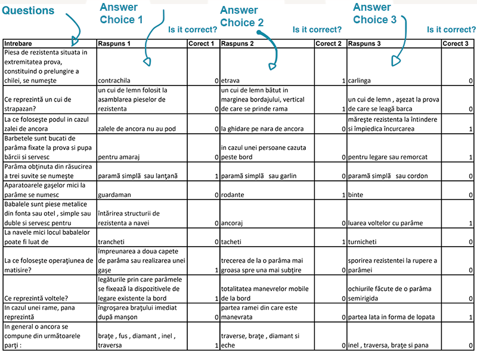

# How my Frontend skills helped me pass a sailing exam

This year I decided to pick up sailing classes and get the skipper license, for leisure sailing, and little have I known that the engineering skills would help me get the permit more easily. Let's dive in!

In my country, the exam has two parts: a "road" test on the sea and a written examination, a lot like the one for the driving licence - it's composed out of 26 multiple-choice questions. For each question, there are three answer choices, one and only one is correct.
The authorities were kind enough to offer for free download a large batch of sample questions. However, all the data is presented in a big big table spread in a multi-page PDF file. Which looks like this, and goes on for 20-30 pages:


<!--  -->

Each line in the table represents a question. Then, each column represents an answer choice, each choice followed by another column - with values 0 or 1, whether the choice is correct or not. Luckily, I managed to take all that data by using the Preview app in MacOS - I simply Selected All -> Copy -> Paste (in vim or any other text editor), and I was able to make some sense of the data.

I did so by writing a nodejs script that would create an Array of meaningful objects. Typescript types are simple enough to use them in order to demonstrate my modeling:

```typescript
type Answer = {
    text: string,
    correct: boolean
}
type Choices = [Answer, Answer, Answer]

type Question = {
    text: string,
    answers: Choices
}

// some sample data
// only for the sake of the example
const answers : Choices = [
  {text: 'fine', correct: false},
  {text: 'awesome', correct: true},
  {text: 'great', correct: false}
];

const question : Question = {text: 'how are you', answers}
```

It looks fancy in Typescript, but honestly I simply wrote a [node script](https://github.com/mihneasim/sailing-exam-questionnaire/blob/main/to-json.js) to dump it all in a big JSON file and get the job done. I believe **proper domain modelling is key** to a successful system - whatever engineering you'd be doing.

Nice. We have data with meaning. Now let's create the presentation layer (aka the UI!) and then let's add interactivity to the UI, so we can have feedback when actually simulating an exam (aka the Frontend!).
Since in ING we are advocates of Web Components, I always wanted to give this stack a try for side projects. I jumped right into [open-wc.org](https://open-wc.org/) and used the npm generator.
Everything worked precisely as expected. It was a breeze since my Chapter is using lit every. single. day. So I could finally get some mileage myself, in writing lit. At work, as a Chapter Lead, I prefer to spend my time more effectively for the team, rather than coding new features by myself; my chapter does it better anyway (#proud).

You can take a look at the [simulator here](http://mesimian.com/anr/simulator/). There are also quick deployments for each topic - [seamanship](http://mesimian.com/anr/marinarie/), [navigation](http://mesimian.com/anr/navigatie/),  [maneuver](http://mesimian.com/anr/manevra/), [COLREG](http://mesimian.com/anr/colreg/), [RND - fresh water regulations](http://mesimian.com/anr/rnd/).
Caution: all texts are in Romanian, since the data source is in Romanian anyway. But you get the gist.

## What I saved for later (read: never)

Things I skipped on purpose, because #shipping:
- unit testing
- styling
- creating a proper API, rather than big bulky json-s sent to the client

It's funny cause when I put a screenshot in here, it looks like an ad 🤭


<!--  -->

## No compromise on

Things I did not want to skip, no-matter-what:
- create a minimum viable product, have it **attain its purpose**: helping people learn for the test (d'oh!)
- deploy it on a webserver and **share it** with my awesome sailing class colleagues
- make it Open Source on [github](https://github.com/mihneasim/sailing-exam-questionnaire/). However, you have to download the full PDFs and run the data conversion yourself. I did not want to include that in the project for a couple of reasons:
  1. it's not my data, I do not have a license to distribute it. Best I could do is package it differently and use it as a support for a free, non-commercial web-app.
  1. hey, data may change anyway
- sharing this diary page with you 🤗. I didn't want to skip that.

**When did your engineering skills help you get through with something totally unrelated?**
