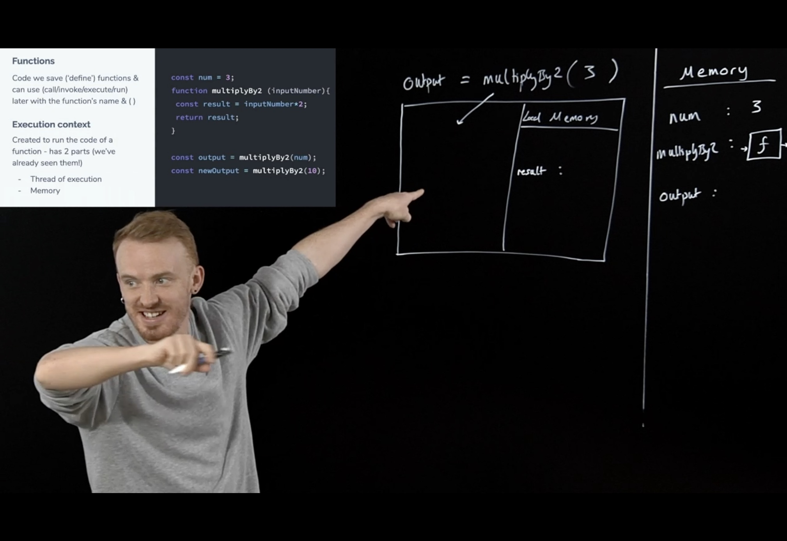

# Will's JS class

I've watched Will Sentance's class JavaScript, The Hard Parts v2, and I liked it - without knowing who he is and how much experience he invested in teaching - I didn't only like it as a student, but especially as a lead and a trainer wannabe. I would like one day to be able to replicate, in my own style, of course, some of his strategies.

## How I ran into the class

In my organisation, we dedicate about 1 day out of 10 sprint days for self-development; yes, that's during office hours, I'm not talking about moonlight coding - or at least that's the *deal on paper*. You probably heard of something similar taking place at Google, on Fridays - that's how Gmail was born. But here, we choose to invest it in the development of our craftsmanship. We're taking this study time in an organised fashion, in alignment with one's development plan. Otherwise, it would just sound like a day off to read online content.

As a Chapter Lead, I struggled to make my chapter take this seriously. Engineers have a greater incentive to perform to the goals of the tribe, so they often commit to the delivery for the entire sprint-time, rather than saving some for their own learning and development. Of course, it is a trap; in the long-run we're rotting as engineers, becoming blind to innovation opportunities and growth. Becoming better professionals would benefit the organisation, the projects, and the effectiveness of the delivery, as a whole.

To move the needle, I become more aggressive in decisions: I asked a colleague to pick a class on Frontend Masters (really , *any* class), by 5 pm the same day, or else I would make this choice for him. So I chose [JavaScript: The Hard Parts, v2](https://frontendmasters.com/courses/javascript-hard-parts-v2/). Since we're working a lot with web components, and we're converting business logic from AngularJs to Vanilla Js classes, it looked like we need strong JavaScript-skilled engineers with proper ownership of the fundamentals of the language. Not just frameworks.

And so, a couple of weeks later, my colleague returned to provide his thoughts. Bracing myself for harsh feedback on my choice of topic, I got particularly enthusiastic to hear that he considered the class *amazing*. *"We all use and think we know those things, but it helps to understand their underlying reasoning once again"*.

Just after Christmas of '22, I had some spare time and gave it a shot. I went through the class myself. The content - indeed, fundamentals of Js. But I was immensely impressed by the manner the class was built and delivered.

I studied Will, I decomposed his style, his setup, and his props, and I reverse-engineered his recipe to three key advantages:

1. Distraction-free teaching "props"
1. Live audience - Real-life students
1. Smart use of creativity

## Distraction-free teaching props

Will is using a blackboard and white or colourful markers. He's not employing
any digital means. He's not typing code, he's writing it, by hand. The representations
limit themselves to basics: global scope, local scope, and execution stack. When
needed, a slide with code pops up.

## Live audience - Real-life students

Will is not recording himself teaching the class to a camera, to a virtual student.
He has actual students sitting and learning physically in the same room. They don't appear in the footage, maybe just rarely when one is "called to the blackboard". You get to be an actual spectator to the learning activities taking part between Will and his students. I've seen this before and it's highly beneficial:
 - you get a sense of what is expected to understand or to have trouble with, in each moment, because the real people in the class will articulate that. You will *feel* what they feel. You will share their silence when some concept needs time *to sink in*.
 - it's auto-paced by the audience. The trainer will adjust speed and level according to a tight, real-time feedback loop with the audience. Will stops after every milestone, to ask how much they understand:
   * thumb up = I got it, move on
   * thumb down = I don't get it
   * horizontal thumb = I need to ask a question

I said I saw this before - ages ago when I started learning German, I ran into
the so-called [Michel Thomas
Method](https://www.youtube.com/watch?v=U9Xh-by50pI) which, besides many other techniques
specific to foreign language learning, also leverages the power of having actual
people participate in the act of teaching together with the trainer, while the class is being recorded for a much
larger, remote, audience.

## Smart use of creativity

Many engineers display passion, but it takes skill and creativity to convey it
in a *catchy* manner, in a phrasing that *sticks*. It takes some degree of
creativity and lateral thinking to portray a JavaScript closure as *a backpack*
that gets carried by a function that's returned as a value.

## Teaching styles are different, 

But some stand out. And by no accident, with solid experience in his backpack, Will Sentance is a model for the teacher in me.
I wouldn't rush out the door, into buying and installing a blackboard. It's not about techniques one can copy.
It's about having the teaching act in the centre, with a spotlight on the main actor -
the student, not the teacher. Whenever you're building a new product, all decisions revolve around
the potential customer. If you look at teaching as a product, then yes, you have
to put the students first, preferably in the same room with you.
